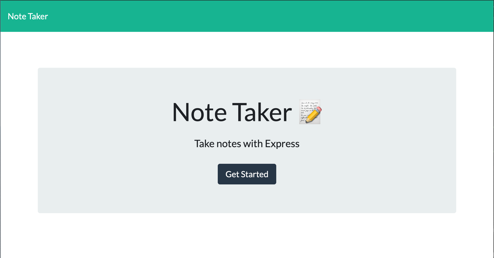
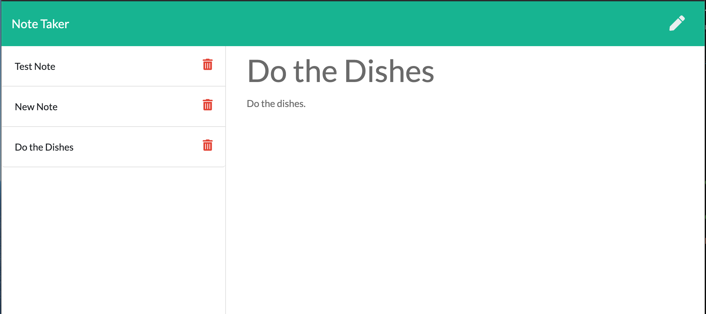

# note-taker

## Description

A note-taker app that is built on an expressJs server. This app allows the user to keep track of notes that persist with reload that are stored in json format. The app uses get and post requests that access the server and displays data.

## Table of Contents

* [Installation](#installation)
* [Usage](#usage)
* [Credits](#credits)
* [License](#license)

## Usage 

* The app can be used in a web browser under the following url: https://peaceful-refuge-43745.herokuapp.com/

## Contributing

All the code for this project was written by Jaydon Goodrich

## License

Code released under the [Unlicense](http://unlicense.org/)

****

## Questions
For further questions I can be reached at:

GitHub: [Jaydon-Goodrich](https://github.com/Jaydon-Goodrich)

Email: JaydonGoodrich@gmail.com

Further Instructions: 

You can also reach out on the following social media platforms:

Instagram: Jaydon-Goodrich

Facebook: Jaydon-Goodrich

LinkedIn: Jaydon-Goodrich
    
## Reference

